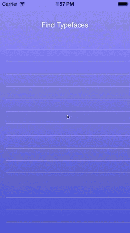

Font-Lister-iOS
===============

Find all the fonts (and font family names) on your iOS device and write them to a JSON file.

<p align="center">
    
</p>

### JSON Output Sample

```
{
  "fonts" : {
    ...
    "Apple SD Gothic Neo" : [
      "AppleSDGothicNeo-Bold",
      "AppleSDGothicNeo-Light",
      "AppleSDGothicNeo-Medium",
      "AppleSDGothicNeo-Regular",
      "AppleSDGothicNeo-SemiBold",
      "AppleSDGothicNeo-Thin"
    ],
    "Arial" : [
      "Arial-BoldItalicMT",
      "Arial-BoldMT",
      "Arial-ItalicMT",
      "ArialMT"
    ],
    "Arial Hebrew" : [
      "ArialHebrew",
      "ArialHebrew-Bold",
      "ArialHebrew-Light"
    ],
    ...
  }
}
```